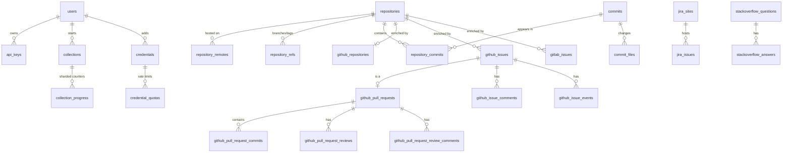

# Raise database schema

This document describes every table in Raise's PostgreSQL database: the ones
that exist today and the ones **planned** for platforms that aren't implemented
yet. It is the reference for anyone querying the data (researchers using SQL or
exports) and for anyone adding tables.

- The source of truth for implemented tables is
  [`internal/db/migrations/`](internal/db/migrations). This document must be
  kept in sync with it.
- Planned tables are a design, not a contract. Refine them when you implement
  them, then move them to the implemented sections.
- For how the code uses these tables, see [architecture.md](architecture.md).

**Status legend:** ✅ implemented (with its migration file) · 📝 planned

**Contents**

1. [Naming conventions](#naming-conventions)
2. [Overview](#overview)
3. [Accounts and access](#accounts-and-access)
4. [Credentials](#credentials)
5. [Collections](#collections)
6. [Git](#git)
7. [GitHub](#github)
8. [GitLab](#gitlab)
9. [Jira](#jira)
10. [Stack Overflow](#stack-overflow)
11. [Tables managed by libraries](#tables-managed-by-libraries)
12. [Example queries](#example-queries)
13. [Changing the schema](#changing-the-schema)

---

## Naming conventions

Raise mixes two kinds of data: records about **our own system** (users,
collections, credentials) and data **mined from platforms** (commits, issues,
questions). Column names make it obvious which world a value comes from.

### Tables

- Names are plural, in `snake_case`.
- Platform-specific tables are prefixed with the platform: `github_issues`,
  `jira_issue_comments`, `stackoverflow_questions`.
- Git tables have no prefix (`commits`, `repositories`), because git is the base
  that forges build on.
- Join tables are named after both sides: `repository_commits`,
  `jira_issue_sprints`.

### Timestamps

All timestamps are `timestamptz` and end in `_at`. Calendar dates with no time
of day are `date` and end in `_date`.

| Name | Meaning |
|---|---|
| `created_at`, `updated_at` | When **our** row was created or changed. Only used on tables describing our own system (`users`, `collections`, …), never for platform data. |
| `first_mined_at` | When Raise first fetched this record from the platform. |
| `last_mined_at` | When Raise last fetched it. It is refreshed on every re-mine, even if nothing changed. |
| `<platform>_created_at`, `<platform>_updated_at`, `<platform>_closed_at`, … | The platform's own timestamps, e.g. `github_created_at` is when the issue was opened on GitHub. |
| `authored_at`, `committed_at` | Git's own commit timestamps. They are unambiguous, so they carry no prefix. |
| other `*_at` | A specific event, named after it: `last_used_at`, `revoked_at`, `finished_at`. |

### Identifiers

| Pattern | Meaning |
|---|---|
| `id` | Our own surrogate key (`bigserial`). |
| `<table>_id` (e.g. `repository_id`, `collection_id`) | Foreign key to one of **our** tables. |
| `user_id`, `created_by` | Always refer to **our** `users` table, never to a platform's users. |
| `<platform>_id` | The identifier the platform assigned to this row (`github_id`, `jira_id`, `stackoverflow_id`). |
| `<role>_<platform>_id` | Reference to another platform entity by the platform's identifier, e.g. `issue_jira_id`, `owner_stackoverflow_id`. These are deliberately **not** foreign keys: a referenced row may not have been mined. |
| `number` | Repository-scoped issue, PR or MR number as shown in the UI (`#123`). For GitLab this is the `iid`. |
| `key` | Human-readable Jira key (`PROJ-123`). |
| `<role>_login` / `<role>_username` / `<role>_account_id` | A person on GitHub, GitLab or Jira, identified the way that platform does: `author_login`, `assignee_username`, `reporter_account_id`. Logins and usernames are as they were when mined, since users can rename themselves. |
| `sha`, `<role>_sha`, `<role>_shas` | Full 40-character git object IDs: `sha`, `commit_sha`, `parent_shas`. |

### Other columns

| Pattern | Meaning |
|---|---|
| `is_*`, `has_*` | Booleans: `is_pull_request`, `is_disabled`, `has_synonyms`. |
| `*_count` | Counts reported by the platform: `comment_count`, `star_count`. |
| `lines_added`, `lines_deleted` | Line changes (never `additions`/`deletions`). `NULL` for binary files. |
| `*_names`, `*_logins`, `*_usernames`, `*_shas` | `text[]` arrays of plain values: `label_names`, `assignee_logins`. |
| `*_seconds`, `*_percent` | Units are part of the name: `time_spent_seconds`, `similarity_percent`. |
| `raw_payload` | `jsonb` with the full API response for the record, so fields that aren't modelled as columns are never lost. |
| `body` / `body_html` / `body_markdown` / `body_text` | Text content, with the format named when it matters. |
| `state`, `status`, `change_type`, … | Lower-case text values, constrained with `CHECK` where the set is ours. Platform-defined values are stored as the platform returns them. |

### Write semantics for mined data

Every mining job is idempotent, so all writes are upserts on the natural key:

- **Immutable records** (commits, commit files) are inserted once
  (`ON CONFLICT DO NOTHING`). They only have `first_mined_at`.
- **Mutable records** (issues, pull requests, questions, …) are updated, but
  only when the incoming `<platform>_updated_at` is not older than the stored
  one. That way an out-of-order page can never overwrite newer data. They have
  both `first_mined_at` and `last_mined_at`.

---

## Overview



Mined data falls into two groups:

- **Repository-centric data:** git tables, plus the forge tables (`github_*`,
  `gitlab_*`) keyed by `repository_id`. Forges never write to git's tables;
  join them to analyse across sources.
- **Standalone sources:** Jira (scoped by `jira_sites`) and Stack Overflow.
  They don't reference repositories, except through explicit link tables such
  as `jira_issue_commits`.

---

## Accounts and access

### `users` ✅

Migration: `00001_auth.sql`. Holds local accounts; there is no self-signup.

| Column | Type | Null | Description |
|---|---|:-:|---|
| `id` | `bigserial` | | Primary key |
| `username` | `text` | | Unique, case-insensitive (`lower(username)` index) |
| `password_hash` | `text` | | argon2id hash in PHC format |
| `role` | `text` | | `viewer`, `researcher` or `admin` |
| `is_disabled` | `boolean` | | Disabled users can't log in; their sessions and API keys stop working |
| `created_at` | `timestamptz` | | |
| `updated_at` | `timestamptz` | | |

### `api_keys` ✅

Migration: `00001_auth.sql`. Personal API keys for scripted access. Only a
SHA-256 hash of each token is stored.

| Column | Type | Null | Description |
|---|---|:-:|---|
| `id` | `bigserial` | | Primary key |
| `user_id` | `bigint` | | → `users.id` (cascade delete) |
| `label` | `text` | | User-chosen name, e.g. "analysis notebook" |
| `token_prefix` | `text` | | First characters of the token (`rk_abc123`), for recognising keys in the UI |
| `token_hash` | `bytea` | | SHA-256 of the full token; unique |
| `created_at` | `timestamptz` | | |
| `last_used_at` | `timestamptz` | ✓ | |
| `expires_at` | `timestamptz` | ✓ | `NULL` means the key never expires |
| `revoked_at` | `timestamptz` | ✓ | Set when the key is revoked |

### `sessions` ✅

Migration: `00001_auth.sql`. Owned by the `scs` session library, which fixes
the column names: `token`, `data` (gob-encoded), `expiry`. Don't query it from
application code.

---

## Credentials

### `credentials` ✅

Migration: `00002_credentials.sql`. Platform API credentials shared by the
whole lab.

| Column | Type | Null | Description |
|---|---|:-:|---|
| `id` | `bigserial` | | Primary key |
| `platform` | `text` | | `github`, `gitlab`, `jira`, `stackoverflow` |
| `kind` | `text` | | Credential kind defined by the platform, e.g. `personal_access_token` |
| `label` | `text` | | Admin-chosen name |
| `public_fields` | `jsonb` | | Non-secret fields, e.g. `{"base_url": "...", "email": "..."}` |
| `secret_hints` | `jsonb` | | Last characters of each secret field, for display (`{"token": "…a1b2"}`) |
| `secret_ciphertext` | `bytea` | | AES-256-GCM encrypted JSON of the secret fields |
| `secret_nonce` | `bytea` | | GCM nonce |
| `encryption_key_version` | `integer` | | Which `ENCRYPTION_KEYS` entry encrypted the secret |
| `status` | `text` | | `active`, `invalid` (failed a test or got a 401) or `disabled` |
| `last_tested_at` | `timestamptz` | ✓ | |
| `last_test_result` | `jsonb` | ✓ | `{ok, reason, identity, quotas}` from the platform's test procedure |
| `created_by` | `bigint` | ✓ | → `users.id` |
| `created_at` | `timestamptz` | | |
| `deleted_at` | `timestamptz` | ✓ | Soft delete |

### `credential_quotas` ✅

Migration: `00002_credentials.sql`. The rate-limit state most recently observed
for each credential, per bucket.

| Column | Type | Null | Description |
|---|---|:-:|---|
| `credential_id` | `bigint` | | → `credentials.id`; part of the primary key |
| `scope` | `text` | | Rate-limit bucket, e.g. GitHub `core`, `search`, `graphql`; part of the primary key |
| `request_limit` | `integer` | | Requests allowed per window |
| `requests_remaining` | `integer` | | Remaining in the current window (decremented optimistically on lease) |
| `resets_at` | `timestamptz` | | When the window resets |
| `observed_at` | `timestamptz` | | When these values were last reported by the platform |

---

## Collections

### `collections` ✅

Migration: `00003_collections.sql`. A user's request to mine something.

| Column | Type | Null | Description |
|---|---|:-:|---|
| `id` | `bigserial` | | Primary key |
| `platform` | `text` | | Platform that started it (`git`, `jira`, `stackoverflow`) |
| `parameters` | `jsonb` | | Platform-specific request, e.g. `{"repository_id": 1, "commits": true}` |
| `status` | `text` | | `running`, `completed`, `partial` (some jobs failed) or `canceled` |
| `created_by` | `bigint` | ✓ | → `users.id` |
| `created_at` | `timestamptz` | | |
| `finished_at` | `timestamptz` | ✓ | Set when the status leaves `running` |

### `collection_progress` ✅

Migration: `00003_collections.sql`. Job counters, sharded into up to 16 rows
per collection to avoid write contention. **Sum over shards to read.**

| Column | Type | Null | Description |
|---|---|:-:|---|
| `collection_id` | `bigint` | | → `collections.id`; part of the primary key |
| `shard` | `smallint` | | 0–15; part of the primary key |
| `jobs_expected` | `bigint` | | Jobs enqueued for the collection (grows as jobs fan out) |
| `jobs_done` | `bigint` | | Jobs completed |
| `jobs_failed` | `bigint` | | Jobs cancelled or out of retries |

---

## Git

Git tables are filled by mining a local mirror of each repository.

### `repositories` ✅

Migration: `00004_git.sql`.

| Column | Type | Null | Description |
|---|---|:-:|---|
| `id` | `bigserial` | | Primary key |
| `url` | `text` | | Canonical `https://host/path` URL without `.git`; unique |
| `host` | `text` | | e.g. `github.com` |
| `path` | `text` | | e.g. `spf13/cobra`, or `group/subgroup/project` |
| `mirror_last_synced_at` | `timestamptz` | ✓ | Last successful clone or fetch of the local mirror |
| `created_at` | `timestamptz` | | When the repository was registered in Raise |

### `repository_remotes` ✅

Migration: `00004_git.sql`. Forges hosting a repository, detected from its URL
at registration.

| Column | Type | Null | Description |
|---|---|:-:|---|
| `repository_id` | `bigint` | | → `repositories.id`; part of the primary key |
| `platform` | `text` | | `github` or `gitlab`; part of the primary key |
| `owner` | `text` | | Owner, organisation or GitLab namespace path |
| `name` | `text` | | Repository name on the forge |

### `commits` ✅

Migration: `00004_git.sql`. One row per commit SHA. Commits are content
addressed, so forks share rows; `repository_commits` records membership.
Rows are inserted once and never updated.

| Column | Type | Null | Description |
|---|---|:-:|---|
| `sha` | `text` | | Primary key |
| `parent_shas` | `text[]` | | Empty for root commits; two or more for merges |
| `author_name`, `author_email` | `text` | | As recorded in the commit |
| `authored_at` | `timestamptz` | | Git author date |
| `committer_name`, `committer_email` | `text` | | |
| `committed_at` | `timestamptz` | | Git committer date |
| `message` | `text` | | Full message (subject and body) |
| `lines_added`, `lines_deleted` | `integer` | | Totals over non-binary files; `0` for merges |
| `files_changed` | `integer` | | `0` for merge commits (merges are not diffed) |
| `first_mined_at` | `timestamptz` | | |

### `repository_commits` ✅

Migration: `00004_git.sql`. Which repositories contain which commits (reachable
from a branch or tag).

| Column | Type | Null | Description |
|---|---|:-:|---|
| `repository_id` | `bigint` | | → `repositories.id`; part of the primary key |
| `sha` | `text` | | → `commits.sha`; part of the primary key |

### `commit_files` ✅

Migration: `00004_git.sql`. Files changed by each non-merge commit, with rename
detection.

| Column | Type | Null | Description |
|---|---|:-:|---|
| `sha` | `text` | | → `commits.sha`; part of the primary key |
| `path` | `text` | | Path after the change (for deletions, the deleted path); part of the primary key |
| `previous_path` | `text` | ✓ | Path before a rename or copy |
| `change_type` | `text` | | `added`, `modified`, `deleted`, `renamed`, `copied`, `type_changed`, `unmerged` |
| `similarity_percent` | `integer` | ✓ | Similarity for renames and copies |
| `lines_added`, `lines_deleted` | `integer` | ✓ | `NULL` for binary files |

### `repository_refs` ✅

Migration: `00004_git.sql`. Branch and tag tips seen when the repository's
commits were last planned.

| Column | Type | Null | Description |
|---|---|:-:|---|
| `repository_id` | `bigint` | | → `repositories.id`; part of the primary key |
| `name` | `text` | | Full ref name, e.g. `refs/heads/main`, `refs/tags/v1.0`; part of the primary key |
| `commit_sha` | `text` | | Commit the ref points to (annotated tags are peeled) |
| `last_seen_at` | `timestamptz` | | |

---

## GitHub

GitHub data is mined through the GraphQL API. Every GitHub table except
`github_users` is keyed by `repository_id` (directly or through a GitHub ID),
and all of them follow the mined-data conventions (`github_*_at`,
`first_mined_at`, `last_mined_at`, `raw_payload`). People are referenced by
`*_login`.

- **IDs.** `github_id` is GitHub's numeric database ID (GraphQL
  `fullDatabaseId`, the same value the REST API calls `id`). `github_node_id`
  is the GraphQL global node ID.
- **`raw_payload`** is the GraphQL node as Raise requested it, minus nested
  connections that have their own tables (comments, timeline items, commits,
  reviews, review threads). It holds every field Raise selects but doesn't
  model as a column, such as `url`, `lastEditedAt` and `activeLockReason`.
- **Enumerations** that GraphQL returns in upper case (`OPEN`, `NOT_PLANNED`,
  `APPROVED`, `PUBLIC`) are stored in lower case, matching the REST API. The
  exception is `author_association` (`OWNER`, `MEMBER`, `CONTRIBUTOR`, …),
  which is upper case in both APIs.
- **Deleted accounts** (GitHub's "ghost") have a `NULL` login.

### `github_repositories` ✅

Migration: `00005_github.sql`. Repository metadata, with one row per
repository. Re-mining overwrites it with the current snapshot.

| Column | Type | Null | Description |
|---|---|:-:|---|
| `repository_id` | `bigint` | | Primary key, → `repositories.id` |
| `github_id` | `bigint` | | |
| `github_node_id` | `text` | | |
| `full_name` | `text` | | `owner/name` as GitHub reports it (it may differ after renames or transfers) |
| `description` | `text` | ✓ | |
| `homepage_url` | `text` | ✓ | |
| `default_branch` | `text` | ✓ | `NULL` for empty repositories |
| `primary_language` | `text` | ✓ | |
| `language_bytes` | `jsonb` | | `{"Go": 123456, ...}` |
| `topic_names` | `text[]` | | |
| `license_spdx_id` | `text` | ✓ | e.g. `MIT`; `NOASSERTION` for unrecognised licenses |
| `visibility` | `text` | | `public`, `private`, `internal` |
| `is_fork`, `is_archived`, `is_template` | `boolean` | | |
| `parent_full_name` | `text` | ✓ | Upstream repository for forks |
| `star_count`, `watcher_count`, `fork_count` | `integer` | | |
| `open_issue_count` | `integer` | | Open issues, **excluding** pull requests (unlike the REST field of the same name) |
| `open_pull_request_count` | `integer` | | |
| `github_created_at`, `github_updated_at` | `timestamptz` | | |
| `github_pushed_at` | `timestamptz` | ✓ | |
| `raw_payload` | `jsonb` | | Includes mirror, lock and feature flags (`hasWikiEnabled`, …), `diskUsage`, template repository |
| `first_mined_at`, `last_mined_at` | `timestamptz` | | |

### `github_issues` ✅

Migration: `00005_github.sql`. Issues **and pull requests**, which share
GitHub's number space. This table holds the conversation (title, body, labels,
assignees); PR-specific fields live in `github_pull_requests` under the same
`number`.

| Column | Type | Null | Description |
|---|---|:-:|---|
| `repository_id` | `bigint` | | → `repositories.id`; part of the primary key |
| `number` | `integer` | | `#number` on GitHub; part of the primary key |
| `github_id` | `bigint` | | |
| `github_node_id` | `text` | | |
| `title` | `text` | | |
| `state` | `text` | | `open` or `closed` (merged pull requests are `closed`) |
| `state_reason` | `text` | ✓ | Issues only: `completed`, `not_planned`, `duplicate`, `reopened` |
| `author_login` | `text` | ✓ | |
| `author_association` | `text` | | |
| `label_names` | `text[]` | | First 100 labels |
| `assignee_logins` | `text[]` | | |
| `milestone_title` | `text` | ✓ | |
| `is_locked` | `boolean` | | |
| `comment_count` | `integer` | | |
| `reaction_counts` | `jsonb` | | Non-zero counts with REST names: `{"+1": 3, "heart": 1, ...}` |
| `is_pull_request` | `boolean` | | |
| `body` | `text` | ✓ | Markdown; `NULL` when empty |
| `github_created_at`, `github_updated_at` | `timestamptz` | | |
| `github_closed_at` | `timestamptz` | ✓ | |
| `raw_payload` | `jsonb` | | |
| `first_mined_at`, `last_mined_at` | `timestamptz` | | |

### `github_pull_requests` ✅

Migration: `00005_github.sql`. Complements the `github_issues` row with the
same `number`; title, body, labels and assignees stay there.

| Column | Type | Null | Description |
|---|---|:-:|---|
| `repository_id`, `number` | `bigint`, `integer` | | Primary key |
| `github_id` | `bigint` | | |
| `github_node_id` | `text` | | |
| `state` | `text` | | `open` or `closed` |
| `is_draft`, `is_merged` | `boolean` | | |
| `author_login`, `merged_by_login` | `text` | ✓ | |
| `head_ref`, `head_sha` | `text` | | Source branch and its tip |
| `head_repository_full_name` | `text` | ✓ | `NULL` if the fork was deleted |
| `base_ref`, `base_sha` | `text` | | Target branch |
| `merge_commit_sha` | `text` | ✓ | |
| `commit_count`, `files_changed`, `lines_added`, `lines_deleted` | `integer` | | |
| `comment_count` | `integer` | | Conversation comments |
| `review_count` | `integer` | | Reviews, including pending ones that aren't mined |
| `review_thread_count` | `integer` | | Inline review threads (GraphQL exposes no total of review comments) |
| `requested_reviewer_logins` | `text[]` | | Pending review requests to users; team requests are in `raw_payload` |
| `github_created_at`, `github_updated_at` | `timestamptz` | | |
| `github_closed_at`, `github_merged_at` | `timestamptz` | ✓ | |
| `raw_payload` | `jsonb` | | Includes `reviewDecision`, `mergeStateStatus`, review requests |
| `first_mined_at`, `last_mined_at` | `timestamptz` | | |

### `github_pull_request_commits` ✅

Migration: `00005_github.sql`. Commits in each PR, in order. `sha` is not a
foreign key, because PR commits from forks may not exist in the mirror. After a
force push, positions are overwritten and positions beyond the new commit count
are deleted. GitHub lists at most 250 commits per pull request.

| Column | Type | Null | Description |
|---|---|:-:|---|
| `repository_id`, `pull_request_number`, `position` | `bigint`, `integer`, `integer` | | Primary key; `position` is 0-based |
| `sha` | `text` | | |
| `first_mined_at` | `timestamptz` | | |

### `github_pull_request_reviews` ✅

Migration: `00005_github.sql`. Submitted reviews. Pending (draft) reviews are
only visible to their author and are not mined.

| Column | Type | Null | Description |
|---|---|:-:|---|
| `github_id` | `bigint` | | Primary key |
| `repository_id`, `pull_request_number` | `bigint`, `integer` | | Indexed together |
| `reviewer_login` | `text` | ✓ | |
| `author_association` | `text` | | |
| `state` | `text` | | `approved`, `changes_requested`, `commented`, `dismissed` |
| `body` | `text` | | Empty string when the review has no summary |
| `commit_sha` | `text` | ✓ | Commit the review was made against |
| `github_submitted_at` | `timestamptz` | ✓ | |
| `github_updated_at` | `timestamptz` | | Reviews can be edited |
| `raw_payload` | `jsonb` | | |
| `first_mined_at`, `last_mined_at` | `timestamptz` | | |

### `github_pull_request_review_comments` ✅

Migration: `00005_github.sql`. Inline comments on diffs, mined through review
threads.

| Column | Type | Null | Description |
|---|---|:-:|---|
| `github_id` | `bigint` | | Primary key |
| `repository_id`, `pull_request_number` | `bigint`, `integer` | | Indexed together |
| `review_github_id` | `bigint` | ✓ | Review the comment belongs to |
| `in_reply_to_github_id` | `bigint` | ✓ | Comment this one replies to |
| `thread_github_node_id` | `text` | | Review thread; groups a comment with its replies |
| `author_login` | `text` | ✓ | |
| `author_association` | `text` | | |
| `path` | `text` | | |
| `line`, `original_line` | `integer` | ✓ | `line` is `NULL` when the comment is outdated |
| `commit_sha` | `text` | ✓ | |
| `diff_hunk` | `text` | | |
| `body` | `text` | | |
| `github_created_at`, `github_updated_at` | `timestamptz` | | |
| `raw_payload` | `jsonb` | | Includes `outdated`, `startLine`, `originalCommit` |
| `first_mined_at`, `last_mined_at` | `timestamptz` | | |

### `github_issue_comments` ✅

Migration: `00005_github.sql`. Conversation comments on issues and PRs.

| Column | Type | Null | Description |
|---|---|:-:|---|
| `github_id` | `bigint` | | Primary key |
| `repository_id`, `issue_number` | `bigint`, `integer` | | The issue or PR commented on; indexed together |
| `author_login` | `text` | ✓ | |
| `author_association` | `text` | | |
| `body` | `text` | | |
| `reaction_counts` | `jsonb` | | As in `github_issues` |
| `github_created_at`, `github_updated_at` | `timestamptz` | | |
| `raw_payload` | `jsonb` | | Includes `isMinimized` and `minimizedReason` |
| `first_mined_at`, `last_mined_at` | `timestamptz` | | |

### `github_issue_events` ✅

Migration: `00005_github.sql`. Timeline events on issues and PRs. Events are
immutable. Comments, reviews and commits also appear in GitHub's timeline but
are stored in their own tables. Noisy event types (`mentioned`, `subscribed`,
project-board moves) are not mined. The mined types are listed in
`internal/platform/github/queries.go`.

| Column | Type | Null | Description |
|---|---|:-:|---|
| `github_node_id` | `text` | | Primary key (timeline items have no numeric ID in GraphQL) |
| `repository_id`, `issue_number` | `bigint`, `integer` | | Indexed together |
| `event_type` | `text` | | The REST event name, e.g. `labeled`, `cross-referenced`, `closed`, `merged`, `head_ref_force_pushed` |
| `actor_login` | `text` | ✓ | |
| `commit_sha` | `text` | ✓ | For `referenced`, `merged` and `head_ref_force_pushed` (the new head) events, and `closed` events caused by a commit |
| `github_created_at` | `timestamptz` | | |
| `raw_payload` | `jsonb` | | The full timeline item: label, assignee, source issue, previous title, … depending on `event_type` |
| `first_mined_at` | `timestamptz` | | |

### `github_commits` 📝

GitHub's view of a commit: links git identities to GitHub accounts. Filled
through `OnCommitsMined` after git mining.

| Column | Type | Description |
|---|---|---|
| `sha` | `text` | Primary key, → `commits.sha` |
| `author_login`, `committer_login` | `text` | `NULL` when the email isn't linked to an account |
| `is_signature_verified` | `boolean` | |
| `first_mined_at`, `last_mined_at` | `timestamptz` | |

### `github_commit_pull_requests` 📝

Which PRs introduced each commit.

| Column | Type | Description |
|---|---|---|
| `repository_id`, `sha`, `pull_request_number` | | Primary key |
| `first_mined_at` | `timestamptz` | |

### `github_releases` 📝

| Column | Type | Description |
|---|---|---|
| `github_id` | `bigint` | Primary key |
| `repository_id` | `bigint` | |
| `tag_name`, `name`, `body` | `text` | |
| `target_commitish` | `text` | |
| `is_draft`, `is_prerelease` | `boolean` | |
| `author_login` | `text` | |
| `github_created_at`, `github_published_at` | `timestamptz` | |
| `raw_payload`, `first_mined_at`, `last_mined_at` | | |

### `github_users` 📝

Profiles of people referenced by `*_login` columns. Mined on demand.

| Column | Type | Description |
|---|---|---|
| `github_id` | `bigint` | Primary key (stable across renames) |
| `login` | `text` | Current login; unique |
| `name`, `company`, `location`, `email`, `blog_url` | `text` | |
| `account_type` | `text` | `User`, `Organization`, `Bot` |
| `is_site_admin` | `boolean` | |
| `follower_count`, `following_count`, `public_repository_count` | `integer` | |
| `github_created_at`, `github_updated_at` | `timestamptz` | |
| `raw_payload`, `first_mined_at`, `last_mined_at` | | |

---

## GitLab

GitLab tables mirror the GitHub design. People are referenced by `*_username`.
GitLab's project-scoped `iid` is stored as `number`.

### `gitlab_projects` 📝

| Column | Type | Description |
|---|---|---|
| `repository_id` | `bigint` | Primary key, → `repositories.id` |
| `gitlab_id` | `bigint` | |
| `path_with_namespace` | `text` | |
| `description`, `default_branch`, `visibility` | `text` | |
| `topic_names` | `text[]` | |
| `is_archived`, `is_fork` | `boolean` | |
| `star_count`, `fork_count`, `open_issue_count` | `integer` | |
| `gitlab_created_at`, `gitlab_last_activity_at` | `timestamptz` | |
| `raw_payload`, `first_mined_at`, `last_mined_at` | | |

### `gitlab_issues` 📝

| Column | Type | Description |
|---|---|---|
| `repository_id`, `number` | | Primary key |
| `gitlab_id` | `bigint` | |
| `title`, `description`, `state` | `text` | State: `opened` or `closed` |
| `author_username`, `closed_by_username` | `text` | |
| `label_names`, `assignee_usernames` | `text[]` | |
| `milestone_title` | `text` | |
| `comment_count`, `upvote_count`, `downvote_count` | `integer` | |
| `is_confidential` | `boolean` | |
| `gitlab_created_at`, `gitlab_updated_at`, `gitlab_closed_at` | `timestamptz` | |
| `raw_payload`, `first_mined_at`, `last_mined_at` | | |

### `gitlab_merge_requests` 📝

| Column | Type | Description |
|---|---|---|
| `repository_id`, `number` | | Primary key |
| `gitlab_id` | `bigint` | |
| `title`, `description`, `state` | `text` | State: `opened`, `closed`, `merged`, `locked` |
| `is_draft` | `boolean` | |
| `author_username`, `merged_by_username` | `text` | |
| `label_names`, `assignee_usernames`, `reviewer_usernames` | `text[]` | |
| `source_branch`, `target_branch` | `text` | |
| `head_sha`, `merge_commit_sha`, `squash_commit_sha` | `text` | |
| `comment_count` | `integer` | |
| `gitlab_created_at`, `gitlab_updated_at`, `gitlab_merged_at`, `gitlab_closed_at` | `timestamptz` | |
| `raw_payload`, `first_mined_at`, `last_mined_at` | | |

### `gitlab_merge_request_commits` 📝

| Column | Type | Description |
|---|---|---|
| `repository_id`, `merge_request_number`, `position` | | Primary key |
| `sha` | `text` | |
| `first_mined_at` | `timestamptz` | |

### `gitlab_notes` 📝

Comments ("notes") on issues and merge requests, including system notes.

| Column | Type | Description |
|---|---|---|
| `gitlab_id` | `bigint` | Primary key |
| `repository_id` | `bigint` | |
| `noteable_type` | `text` | `issue` or `merge_request` |
| `noteable_number` | `integer` | |
| `author_username` | `text` | |
| `body` | `text` | |
| `is_system` | `boolean` | Generated by GitLab (state changes, label changes) |
| `diff_path`, `diff_line` | `text`, `integer` | For diff notes on merge requests |
| `gitlab_created_at`, `gitlab_updated_at` | `timestamptz` | |
| `raw_payload`, `first_mined_at`, `last_mined_at` | | |

### `gitlab_users` 📝

| Column | Type | Description |
|---|---|---|
| `gitlab_id` | `bigint` | Primary key, together with the host (users are per instance) |
| `host` | `text` | e.g. `gitlab.com` |
| `username`, `name`, `state` | `text` | |
| `is_bot` | `boolean` | |
| `gitlab_created_at` | `timestamptz` | |
| `raw_payload`, `first_mined_at`, `last_mined_at` | | |

---

## Jira

Jira is a standalone source. A lab may mine several Jira sites, so every table
is scoped by `site_id`. Jira's own IDs are numeric strings, stored as `text` in
`jira_id`. People are referenced by `*_account_id`.

Jira's rich text (Atlassian Document Format) is stored twice: as `*_adf`
(`jsonb`, lossless) and as `*_text` (plain text, for analysis).

### `jira_sites` 📝

| Column | Type | Description |
|---|---|---|
| `id` | `bigserial` | Primary key |
| `base_url` | `text` | e.g. `https://your-org.atlassian.net`; unique |
| `created_at` | `timestamptz` | When the site was first mined in Raise |

### `jira_projects` 📝

| Column | Type | Description |
|---|---|---|
| `site_id`, `jira_id` | | Primary key |
| `key` | `text` | e.g. `PROJ` |
| `name`, `description` | `text` | |
| `project_type` | `text` | `software`, `business`, `service_desk` |
| `is_team_managed` | `boolean` | Team-managed ("simplified") vs company-managed |
| `lead_account_id` | `text` | |
| `raw_payload`, `first_mined_at`, `last_mined_at` | | |

### `jira_issues` 📝

| Column | Type | Description |
|---|---|---|
| `site_id`, `jira_id` | | Primary key |
| `key` | `text` | e.g. `PROJ-123`; unique per site |
| `project_jira_id` | `text` | |
| `issue_type_name` | `text` | e.g. `Bug`, `Story`, `Epic` |
| `is_subtask` | `boolean` | |
| `parent_jira_id` | `text` | Parent issue for sub-tasks and epic children |
| `summary` | `text` | |
| `description_adf`, `description_text` | `jsonb`, `text` | |
| `status_name`, `status_category` | `text` | Category: `new`, `indeterminate`, `done` |
| `priority_name`, `resolution_name` | `text` | |
| `creator_account_id`, `reporter_account_id`, `assignee_account_id` | `text` | |
| `label_names`, `component_names`, `fix_version_names` | `text[]` | |
| `due_date` | `date` | |
| `original_estimate_seconds`, `remaining_estimate_seconds`, `time_spent_seconds` | `integer` | |
| `jira_created_at`, `jira_updated_at`, `jira_resolved_at` | `timestamptz` | |
| `raw_payload` | `jsonb` | Includes custom fields (story points, checklists, …) |
| `first_mined_at`, `last_mined_at` | `timestamptz` | |

### `jira_issue_comments` 📝

| Column | Type | Description |
|---|---|---|
| `site_id`, `jira_id` | | Primary key |
| `issue_jira_id` | `text` | |
| `author_account_id`, `update_author_account_id` | `text` | |
| `body_adf`, `body_text` | `jsonb`, `text` | |
| `jira_created_at`, `jira_updated_at` | `timestamptz` | |
| `raw_payload`, `first_mined_at`, `last_mined_at` | | |

### `jira_issue_changes` and `jira_issue_change_items` 📝

The issue changelog. Each change, made by one author at one time, has one or
more items, one per field changed. Changes are immutable.

`jira_issue_changes`:

| Column | Type | Description |
|---|---|---|
| `site_id`, `jira_id` | | Primary key |
| `issue_jira_id` | `text` | |
| `author_account_id` | `text` | |
| `jira_created_at` | `timestamptz` | |
| `first_mined_at` | `timestamptz` | |

`jira_issue_change_items`:

| Column | Type | Description |
|---|---|---|
| `site_id`, `change_jira_id`, `position` | | Primary key |
| `field_name` | `text` | e.g. `status`, `assignee`, `Sprint` |
| `field_type` | `text` | `jira` or `custom` |
| `from_value`, `to_value` | `text` | Raw values (IDs) |
| `from_display`, `to_display` | `text` | Human-readable values (Jira's `fromString`/`toString`) |

### `jira_issue_links` 📝

| Column | Type | Description |
|---|---|---|
| `site_id`, `jira_id` | | Primary key |
| `link_type_name` | `text` | e.g. `Blocks`, `Duplicate`, `Relates` |
| `outward_issue_jira_id` | `text` | The issue that e.g. *blocks* |
| `inward_issue_jira_id` | `text` | The issue that *is blocked by* |
| `first_mined_at`, `last_mined_at` | `timestamptz` | |

### `jira_sprints` and `jira_issue_sprints` 📝

`jira_sprints`:

| Column | Type | Description |
|---|---|---|
| `site_id`, `jira_id` | | Primary key |
| `board_jira_id` | `text` | |
| `name`, `goal`, `state` | `text` | State: `future`, `active`, `closed` |
| `jira_starts_at`, `jira_ends_at` | `timestamptz` | Planned dates |
| `jira_completed_at` | `timestamptz` | |
| `raw_payload`, `first_mined_at`, `last_mined_at` | | |

`jira_issue_sprints`: (`site_id`, `issue_jira_id`, `sprint_jira_id`) as the
primary key, plus `first_mined_at`.

### `jira_worklogs` 📝

| Column | Type | Description |
|---|---|---|
| `site_id`, `jira_id` | | Primary key |
| `issue_jira_id` | `text` | |
| `author_account_id` | `text` | |
| `time_spent_seconds` | `integer` | |
| `comment_text` | `text` | |
| `jira_started_at`, `jira_created_at`, `jira_updated_at` | `timestamptz` | |
| `first_mined_at`, `last_mined_at` | `timestamptz` | |

### `jira_issue_commits` 📝

Commits linked to issues through Jira's development panel. This table bridges
Jira and git data.

| Column | Type | Description |
|---|---|---|
| `site_id`, `issue_jira_id`, `sha` | | Primary key |
| `repository_url` | `text` | As reported by Jira |
| `repository_id` | `bigint` | → `repositories.id` when that repository is registered in Raise, else `NULL` |
| `first_mined_at` | `timestamptz` | |

### `jira_users` 📝

| Column | Type | Description |
|---|---|---|
| `site_id`, `account_id` | | Primary key |
| `display_name`, `email_address` | `text` | The email is often hidden by privacy settings |
| `account_type` | `text` | `atlassian`, `app`, `customer` |
| `time_zone` | `text` | |
| `is_active` | `boolean` | |
| `raw_payload`, `first_mined_at`, `last_mined_at` | | |

---

## Stack Overflow

Stack Overflow is a standalone source. Stack Exchange post and user IDs are
numeric and stored as `stackoverflow_id`. Only the `stackoverflow` site is
supported; supporting other Stack Exchange sites would add a `site` column to
every key.

### `stackoverflow_questions` 📝

| Column | Type | Description |
|---|---|---|
| `stackoverflow_id` | `bigint` | Primary key (question ID) |
| `owner_stackoverflow_id` | `bigint` | Asking user; `NULL` for deleted users |
| `title` | `text` | |
| `body_html`, `body_markdown` | `text` | |
| `link` | `text` | |
| `tag_names` | `text[]` | |
| `score`, `up_vote_count`, `down_vote_count`, `view_count`, `favorite_count` | `integer` | |
| `answer_count`, `comment_count` | `integer` | |
| `is_answered` | `boolean` | |
| `accepted_answer_stackoverflow_id` | `bigint` | |
| `closed_reason` | `text` | |
| `content_license` | `text` | e.g. `CC BY-SA 4.0` |
| `stackoverflow_created_at`, `stackoverflow_last_activity_at`, `stackoverflow_last_edited_at`, `stackoverflow_closed_at` | `timestamptz` | |
| `raw_payload`, `first_mined_at`, `last_mined_at` | | |

### `stackoverflow_answers` 📝

| Column | Type | Description |
|---|---|---|
| `stackoverflow_id` | `bigint` | Primary key (answer ID) |
| `question_stackoverflow_id` | `bigint` | |
| `owner_stackoverflow_id` | `bigint` | |
| `body_html`, `body_markdown` | `text` | |
| `link` | `text` | |
| `score`, `up_vote_count`, `down_vote_count`, `comment_count` | `integer` | |
| `is_accepted` | `boolean` | |
| `content_license` | `text` | |
| `stackoverflow_created_at`, `stackoverflow_last_activity_at`, `stackoverflow_last_edited_at` | `timestamptz` | |
| `raw_payload`, `first_mined_at`, `last_mined_at` | | |

### `stackoverflow_comments` 📝

| Column | Type | Description |
|---|---|---|
| `stackoverflow_id` | `bigint` | Primary key (comment ID) |
| `post_type` | `text` | `question` or `answer` |
| `post_stackoverflow_id` | `bigint` | |
| `owner_stackoverflow_id`, `reply_to_stackoverflow_id` | `bigint` | |
| `body_html`, `body_markdown` | `text` | |
| `score` | `integer` | |
| `is_edited` | `boolean` | |
| `content_license` | `text` | |
| `stackoverflow_created_at` | `timestamptz` | |
| `raw_payload`, `first_mined_at`, `last_mined_at` | | |

### `stackoverflow_tags` 📝

| Column | Type | Description |
|---|---|---|
| `name` | `text` | Primary key |
| `question_count` | `integer` | |
| `has_synonyms`, `is_moderator_only`, `is_required` | `boolean` | |
| `synonym_names` | `text[]` | |
| `stackoverflow_last_activity_at` | `timestamptz` | |
| `first_mined_at`, `last_mined_at` | `timestamptz` | |

### `stackoverflow_users` 📝

| Column | Type | Description |
|---|---|---|
| `stackoverflow_id` | `bigint` | Primary key (site user ID) |
| `network_account_id` | `bigint` | Stack Exchange network-wide account |
| `display_name`, `user_type` | `text` | Type: `registered`, `unregistered`, `moderator`, … |
| `location`, `website_url`, `profile_url`, `about_me` | `text` | |
| `reputation`, `accept_rate` | `integer` | |
| `question_count`, `answer_count`, `view_count`, `up_vote_count`, `down_vote_count` | `integer` | |
| `gold_badge_count`, `silver_badge_count`, `bronze_badge_count` | `integer` | |
| `is_employee` | `boolean` | |
| `stackoverflow_created_at`, `stackoverflow_last_accessed_at`, `stackoverflow_last_modified_at` | `timestamptz` | |
| `raw_payload`, `first_mined_at`, `last_mined_at` | | |

---

## Tables managed by libraries

These tables exist in the same database but are created and owned by
libraries. Never alter them in app migrations.

| Tables | Owner | Notes |
|---|---|---|
| `river_*` (`river_job`, `river_queue`, `river_leader`, `river_migration`, …) | River | The job queue. Created by `raisectl migrate up` before the app migrations. Collection jobs carry `{"collection_id": N}` in `river_job.metadata`. Completed jobs are deleted by River after a retention period. |
| `sessions` | scs | See [Accounts and access](#accounts-and-access). |
| `goose_db_version` | goose | Which app migrations have been applied. |

---

## Example queries

Commits per month in a repository:

```sql
SELECT date_trunc('month', c.committed_at) AS month, count(*) AS commits
FROM repository_commits rc
JOIN commits c ON c.sha = rc.sha
JOIN repositories r ON r.id = rc.repository_id
WHERE r.url = 'https://github.com/spf13/cobra'
GROUP BY 1 ORDER BY 1;
```

Files most often changed, with renames followed to their current path:

```sql
SELECT f.path, count(*) AS times_changed, sum(f.lines_added + f.lines_deleted) AS churn
FROM repository_commits rc
JOIN commit_files f ON f.sha = rc.sha
WHERE rc.repository_id = 1 AND f.change_type <> 'deleted'
GROUP BY f.path ORDER BY times_changed DESC LIMIT 20;
```

Time to close GitHub issues (excluding pull requests). Note the platform
timestamps, not the mining timestamps:

```sql
SELECT number, title,
       github_closed_at - github_created_at AS time_to_close
FROM github_issues
WHERE repository_id = 1 AND NOT is_pull_request AND github_closed_at IS NOT NULL
ORDER BY time_to_close DESC;
```

Time from opening a merged pull request to its first approval:

```sql
SELECT p.number, min(r.github_submitted_at) - p.github_created_at AS time_to_first_approval
FROM github_pull_requests p
JOIN github_pull_request_reviews r
  ON r.repository_id = p.repository_id AND r.pull_request_number = p.number AND r.state = 'approved'
WHERE p.repository_id = 1 AND p.is_merged
GROUP BY p.number, p.github_created_at
ORDER BY time_to_first_approval DESC;
```

Collection progress:

```sql
SELECT c.id, c.status, sum(p.jobs_expected) AS expected, sum(p.jobs_done) AS done, sum(p.jobs_failed) AS failed
FROM collections c LEFT JOIN collection_progress p ON p.collection_id = c.id
GROUP BY c.id ORDER BY c.id DESC;
```

---

## Changing the schema

1. **Follow the [naming conventions](#naming-conventions).** If the table is
   listed as 📝 planned here, start from that design.
2. **Add a migration** in `internal/db/migrations/`, numbered after the latest,
   with `-- +goose Up` and `-- +goose Down` sections. Never edit a migration
   that has been applied anywhere outside development; add a new one instead.
3. **Add queries** to the owning package's `query.sql` and run
   `make generate`. Never edit the generated `sqlc/` code.
4. **Update this document** in the same change: move the table to ✅ with its
   migration file and the final columns, or edit the changed columns.
5. **Keep API field names equal to column names**, so the HTTP API, exports
   and SQL all use the same vocabulary.
