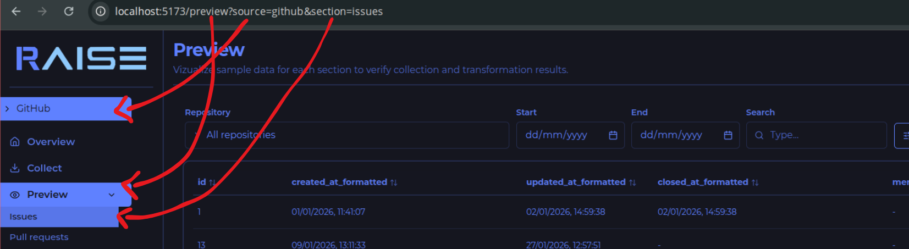

# Frontend general organization and how to create a new module

This README centralizes the frontend architecture and the flow to create a new source (full module of `overview + collect + preview + date`).

## Stack and quick setup

- `React + Vite` -> SPA application base.
- `react-router-dom` -> page routing.
- `@tanstack/react-query` -> cache, loading, and date synchronization.
- `axios` -> HTTP client for API.
- `Tailwind + internal components` -> reusable UI.
- `Storybook` -> component catalog/visual validation.

Main scripts:

- `npm run dev` -> starts local environment.
- `npm run build` -> creates production build.
- `npm run storybook` -> starts component visual documentation.

Environment variable (set in .env):

- `VITE_API_URL` -> API base URL consumed in `src/date/api/apiClient.ts` - backend route.

## Application execution map (main files)

- `src/main.tsx` -> injects `ThemeProvider` (light/dark theme), `QueryClientProvider` (tanstack query), `RouterProvider` (routing), and `Toast` (alerts); consumes `queryClient` through the `@/data` barrel.
- `src/router.tsx` -> defines routes `/overview`, `/collect`, `/preview`, and `/jobs`.
- `src/layout.tsx` -> renders base structure `Sidebar + Outlet`.
- `src/sidebar/Sidebar.tsx` -> sidebar configuration and page-switching logic; uses URL `source/section` as single source of truth.
- `src/pages/OverviewPage.tsx` -> picks overview module by current `source`.
- `src/pages/CollectPage.tsx` -> picks collect module by current `source`.
- `src/pages/PreviewPage.tsx` -> picks preview module by `source + section`.
- `src/pages/JobsPage.tsx` -> lists global jobs and executes stop/restart actions.
- `src/pages/NotFound.tsx` -> app 404 fallback.
- `src/date/index.ts` -> single date layer entry point for pages and components (`hooks`, `types`, `queryClient`, helpers, and section types).

## Routes and query params (navigation source)

- `source` -> defines which integration is active (`github`, `jira`, `stackoverflow`).
- `section` -> defines which preview subarea is active (only in `/preview`).



Files that control the rule:

- `src/sources/index.ts` -> global contract of ids, labels, defaults, and sections by source.
- `src/lib/source-section-resolver.ts` -> normalizes invalid `source/section` into valid values.
- `src/sidebar/Sidebar.tsx` and `src/sidebar/sidebarNavigation.ts` -> preserve `source`, keep `section` only in preview and removes it outside, and also auto-fix invalid URL with `replace`.

## Folder organization (architectural view)

```txt
src/
  components/ -> shared UI (cards, tables, filters, modals, etc.), each component is in its own folder and has Storybook documentation.
  pages/      -> route pages (overview, collect, preview, jobs)
  sidebar/    -> side navigation and URL rules
  sources/    -> UI modules by source
  date/       -> API + React Query layer + domain modules by source (communication with backend)
  lib/        -> support utilities (resolvers, theme, helpers)
```

## Component pattern + Storybook

To keep documentation and usage consistency:

- Every shared component must be in `src/components/<component-name>/`.
- Inside the folder, keep at least `<Component>.tsx` (implementation), `<Component>.stories.tsx` (Storybook documentation/usage), and `index.ts` (export only what should be exposed externally).
- External imports must point to the folder barrel (`@/components/<component-name>`), avoiding direct imports of internal files.

## `src/date` layer (backend + cache)

### `src/date/api`

- `apiClient.ts` -> instantiates axios with base URL and interceptor that returns `res.data`.
- `endpoints.ts` -> centralizes dashboard, preview, collect, and jobs HTTP routes.

### `src/date/query`

- `client.ts` -> configures the app single `QueryClient`.
- `keys.ts` -> generates standardized query keys by source + jobs keys.
- `invalidation.ts` -> centralizes reusable invalidators (for example: jobs).
- `errors.ts` -> normalizes error objects into user-friendly message.

### `src/date/modules`

Each domain follows the same pattern:

- `<source>Types.ts` -> centralizes params, payload, and response contracts.
- `<source>Service.ts` -> contains only HTTP calls for each domain endpoint.
- `<source>Queries.ts` -> encapsulates `useQuery` with standardized `queryKey` - queries are operations used to fetch/read information.
- `<source>Mutations.ts` -> encapsulates `useMutation` and post-action invalidations - mutations are operations used to create, edit, or removes information.
- `index.ts` -> aggregates and re-exports module `queries`, `mutations`, and `types`.

Consumption barrel:

- `src/date/index.ts` -> is the single consumption point for pages/components: re-exports query/mutation hooks, module types, `section` types, `queryClient`, and error helper.
- UI import pattern -> always prefer `@/data`; avoid direct imports from `@/data/modules/*`, `@/data/api/*`, and `@/data/query/*`.

Default flow:

`Component/Page (imports from "@/data")` -> `Query/Mutation hook` -> `Service` -> `endpoints + apiClient` -> `Backend`

## `src/sources` layer (UI by source)

This layer role:

- `Overview` -> filters + chart + metric cards.
- `Collect` -> input form and collection trigger.
- `Preview` -> paginated table with search, sorting, export, and filters.

Core files:

- `src/sources/index.ts` -> typed contract for sources/sections/labels/defaults (used so the whole frontend has only one standardized consumption source).
- `src/sources/registry.ts` -> registry that links source to real UI components (used for mapping in OverviewPage, CollectPage, and PreviewPage).

Shared logic functions, reused by multiple sources:

- `sources/shared/AllShared.ts` -> generic option helpers for selects.
- `sources/shared/OverviewShared.ts` -> overview filter/card/series builders.
- `sources/shared/CollectShared.ts` -> collection tag and feedback helpers.
- `sources/shared/PreviewShared.ts` -> preview table, sort, export, and feedback helpers.

Composed components used directly to build pages:

- `src/components/overview/*` -> overview-specific components that already group smaller blocks (filters, layout, chart, and metrics) for each module to configure.
- `src/components/collect/*` -> collect-specific components that already group smaller blocks (header, tags, dates, and actions) for each module to configure.
- `src/components/preview/*` -> preview-specific components that already group smaller blocks (header, table, modal, and export) for each module to configure.
- `Recurring pattern, not mandatory` -> the project usually follows this model to speed up new modules, but each source can deviate from it when it makes sense.
